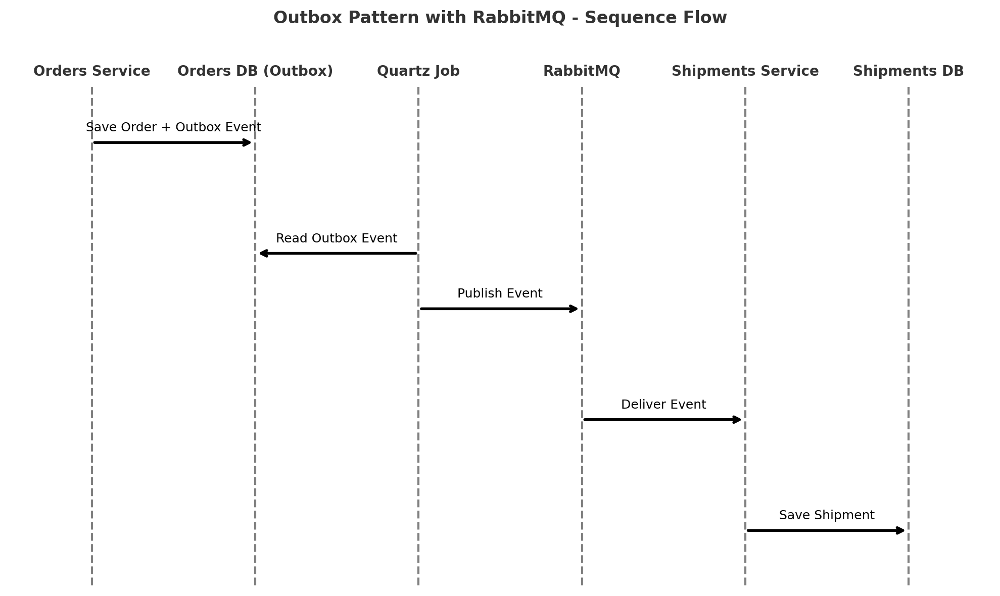
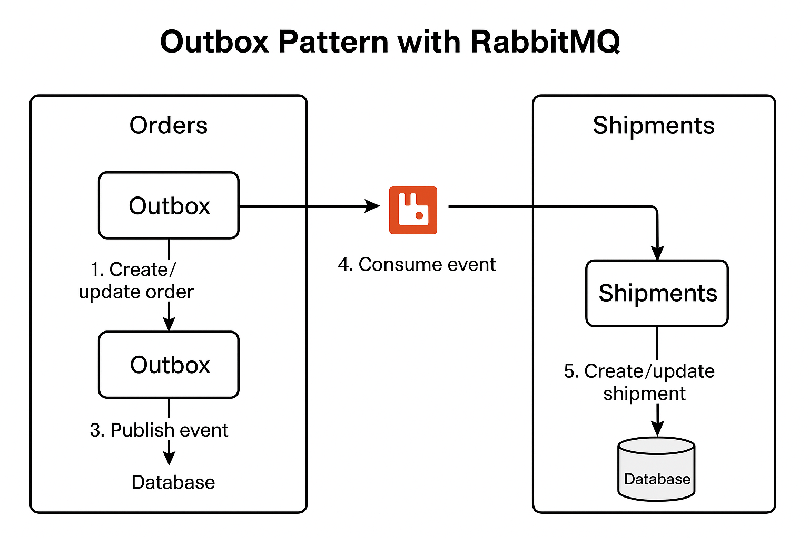



---

# Outbox Pattern with RabbitMQ & .NET

## 📖 Overview

This solution demonstrates the **Outbox Pattern** implemented with **.NET 9**, **Entity Framework Core**, **FluentMigrator**, **Quartz.NET**, and **MassTransit with RabbitMQ**.
The goal is to ensure **reliable event publishing** in a distributed system by persisting domain events in a database before sending them to a message broker.

This architecture avoids message loss and guarantees consistency between your application state and published events.

---

## 🧩 Outbox Pattern Concept

The **Outbox Pattern** solves the **dual-write problem**:

* When you update the database **and** publish an event, one of them might fail, leading to **inconsistencies**.
* With Outbox, you **first save the event to the database** in the same transaction as your business operation.
* A **background processor (Quartz job)** later reads the Outbox table and publishes the event to RabbitMQ.

This ensures **atomicity** and guarantees that **no event is lost**.

---

## Diagram 


</br>
</br>
</br>



---
## 📂 Projects in the Solution

* **OutboxPatternDbInitializer**
  Handles database migrations using **FluentMigrator**. Creates tables for `Orders`, `Shipments`, and `OrdersOutbox`.

* **OutboxPatternOrders**
  An API that manages orders.

  * Persists orders to the database.
  * Saves events to the **Outbox table** instead of sending them directly.
  * Uses Quartz + MassTransit to publish events to RabbitMQ.

* **OutboxPatternShipments**
  An API that consumes order events.

  * Listens to RabbitMQ via MassTransit.
  * Creates and updates shipments in the database.

* **OutboxPattern.Shared**
  A class library with **shared contracts, enums, and DTOs** between the services.

---

## ▶️ How to Run

### 1. Clone the repository

```sh
git clone <repo-url>
cd dotnet-outbox-pattern
```

### 2. Run PostgreSQL and RabbitMQ (Docker)

```sh
docker-compose up -d
```

> Make sure your `appsettings.json` has the correct connection strings for PostgreSQL and RabbitMQ.

### 3. Apply Database Migrations

```sh
cd OutboxPatternDbInitializer
dotnet run
```

### 4. Start the Applications

In separate terminals:

```sh
cd OutboxPatternOrders
dotnet run

cd OutboxPatternShipments
dotnet run
```

### 5. Test the Flow

* Create an order:

```sh
curl -X POST http://localhost:5000/orders \
     -H "Content-Type: application/json" \
     -d '{"product": "Laptop", "quantity": 1}'
```

* Check that the `orders_outbox` table has a new entry.
* After Quartz runs, the event will be published to RabbitMQ.
* The `OutboxPatternShipments` app will consume the event and create a new shipment.

---

## 📚 References

* [Outbox Pattern Explained (YouTube)](https://www.youtube.com/watch?v=RjO2AH8JmV8)
* [Implementing the Outbox Pattern (Milan Jovanović)](https://www.milanjovanovic.tech/blog/implementing-the-outbox-pattern)
* [Scheduling Background Jobs with Quartz.NET (Milan Jovanović)](https://www.milanjovanovic.tech/blog/scheduling-background-jobs-with-quartz-net)

---

## 📬 Contact

* **Email:** [wellington.macena.23@gmail.com](mailto:wellington.macena.23@gmail.com)
* **LinkedIn:** [Wellington Macena](https://www.linkedin.com/in/wellington-macena-dev/)

---
